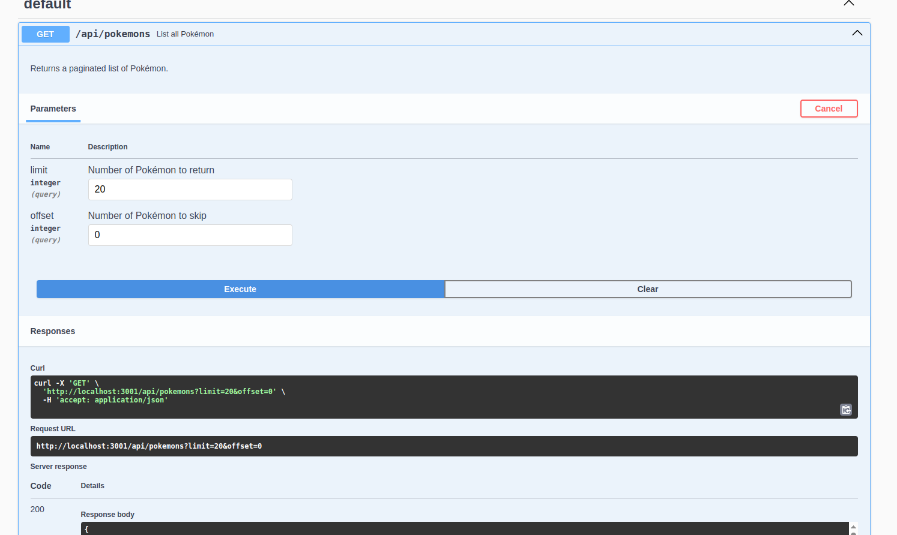
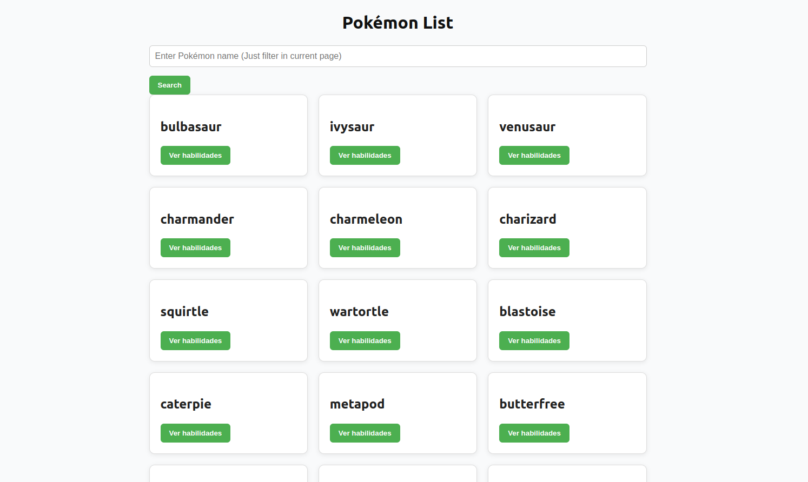
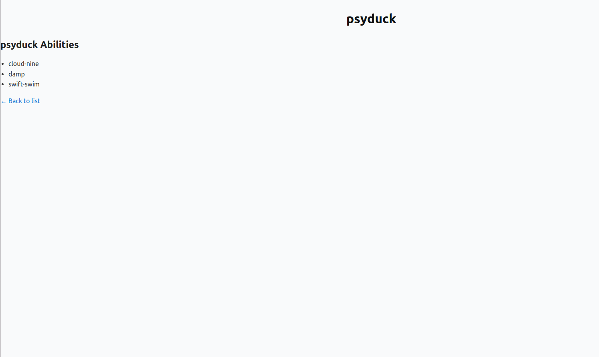

# PokeAPI Abilities App

Este é um projeto fullstack que consome a [PokeAPI](https://pokeapi.co) para listar Pokémons e exibir suas habilidades. O backend foi construído com Node.js + Express, seguindo princípios de **Clean Architecture**, **SOLID** e **DDD**. O frontend utiliza **React + Vite**, com foco em separação de responsabilidades e estrutura limpa.

O projeto é completamente containerizado com Docker e possui automação via `Makefile` para facilitar o desenvolvimento.

---

## Observações Pessoais

Devido ao tempo escasso, não consegui dedicar tanto tempo ao frontend quanto gostaria. Algumas melhorias ainda podem ser implementadas, como testes automatizados, reorganização da estrutura de componentes e ajustes visuais.

No backend, há espaço para evoluções no código, especialmente em termos de desacoplamento, validações e refinamento de alguns casos de uso.

Ainda pretendo fazer essas melhorias à medida que houver mais disponibilidade.

Na pasta `prints/` estão incluídas imagens que comprovam o funcionamento da aplicação, como a listagem dos Pokémons, a visualização das habilidades e a documentação via Swagger.

---

## Tecnologias Utilizadas

- **Backend:** Node.js, TypeScript, Express, Jest, Swagger, Docker
- **Frontend:** React, Vite, TypeScript, CSS global simples
- **Infra:** Docker, Docker Compose, Makefile

---

## Estrutura do Projeto

```
pokeapi-abilities-app/
├── backend/              # API Express com TypeScript
├── frontend/             # Interface React com Vite
├── prints/               # Imagens de uso e testes
├── docker-compose.yml    # Orquestração dos containers
├── Makefile              # Atalhos para build, up, test, etc.
└── README.md             # Documentação
```

---

## Como Executar

### Com Docker + Makefile

1. Suba tudo com cache limpo:
```bash
make clean
make build
make init
make up
```

2. Acesse:
- API: [http://localhost:3001/api](http://localhost:3001/api)
- Swagger: [http://localhost:3001/api/docs](http://localhost:3001/api/docs)
- Frontend: [http://localhost:5173](http://localhost:5173)

---

### Rodando manualmente sem Docker

#### Backend

```bash
cd backend
npm install
npm run dev
```

#### Frontend

```bash
cd frontend
npm install
npm run dev
```

---

## Exemplos de Uso

### Listar Pokémons

```
GET /api/pokemons
```

### Habilidades de um Pokémon

```
GET /api/pokemons/{pokemon}/abilities
```

---

## Prints do Funcionamento

| Swagger (API docs) | Frontend (Listagem) | Frontend (Detalhes) |
|--------------------|---------------------|----------------------|
|  |  |  |

---

## Principais Comandos do Make

| Comando              | Descrição                                      |
|----------------------|-----------------------------------------------|
| `make build`         | Build dos containers com cache                |
| `make rebuild`       | Build dos containers sem cache                |
| `make init`          | Instala dependências nos containers           |
| `make up`            | Sobe a aplicação em modo dev                  |
| `make clean`         | Remove containers, volumes e rede             |
| `make test`          | Roda todos os testes do backend               |
| `make dev-shell`     | Entra no shell interativo do backend          |

---

## Testes

### Unitários

```bash
make test-unit
```

### Integração

```bash
make test-integration
```

---

## Licença

MIT